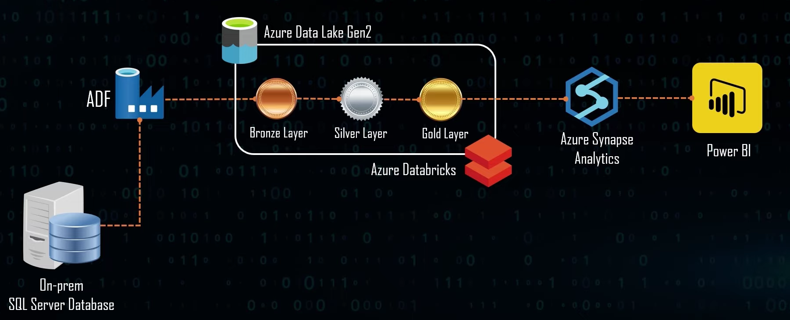
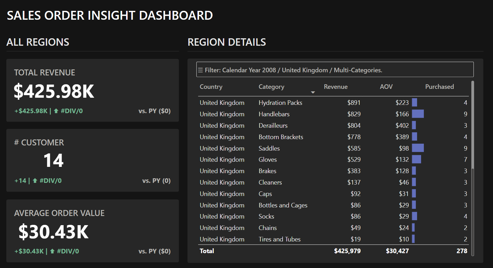
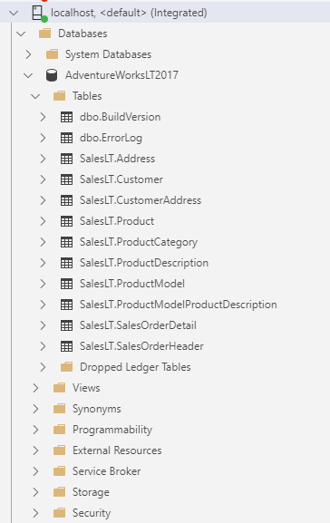
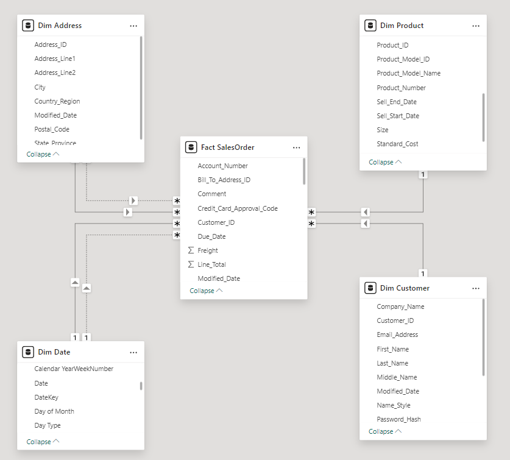

# Azure Data Engineering Project

## 💥 About

A small project to play with Azure services for Data Engineering

Techstacks that I used in this project:
- ELT: Azure Data Factory, Azure Databricks
- Data lake and data warehouse: Azure Data Lake Storage Gen2, Azure Synapse Analytics
- Visualization: Power BI

## 🎯 Knowledge & techniques that I achieved

- How to use Azure sevices for Data Engineering's tasks.
- Migrate data from on-premise to cloud.
- Standardize data model for OLAP.

## ⚒️ Modules that I implemented

- Sales Orders

## 🚀 How to check this project

Download the dashboard at [`SalesOrderDashboard.pbix`](./SalesOrderDashboard.pbix).\
Check out the code for data transformation at [`notebook`](notebook).
<!-- You can find data models at [`models/analytics`](models/analytics). -->
Quick look on my report:

Data source on-premise:\

Final Model:\

## More info
- Raw dataset: [Adventure Works Lightweight 2017](https://learn.microsoft.com/en-us/sql/samples/adventureworks-install-configure?view=sql-server-ver16&tabs=ssms)
- Instruction: [End to End Azure Data Engineering Real Time Project](https://youtube.com/playlist?list=PLrG_BXEk3kXx6KE4nBmhf6QwSHMbznP2W&si=IIP03uD1OUWlBiPL)
- Dashboard design idea: [Customer Insight Dashboard by Khoi Nguyen (Neil) Vo](https://app.powerbi.com/view?r=eyJrIjoiMjI2NjdmOGYtYjhmZS00NzE1LWJhM2ItYWIyYWMwOWVlNDU3IiwidCI6IjYxYTUzMDU4LTlkNDEtNDg5ZS04NGRlLTM3ODg3MzBhMzgxYyIsImMiOjEwfQ%3D%3D)